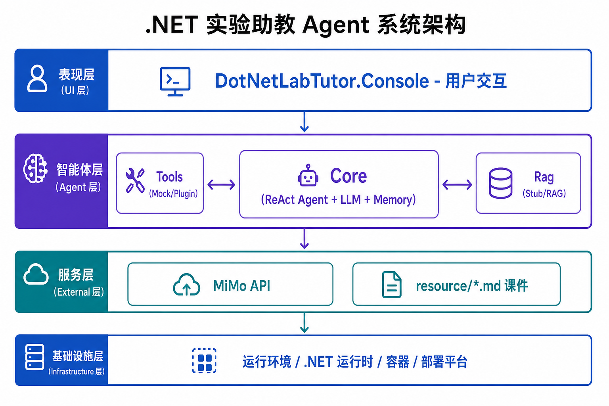
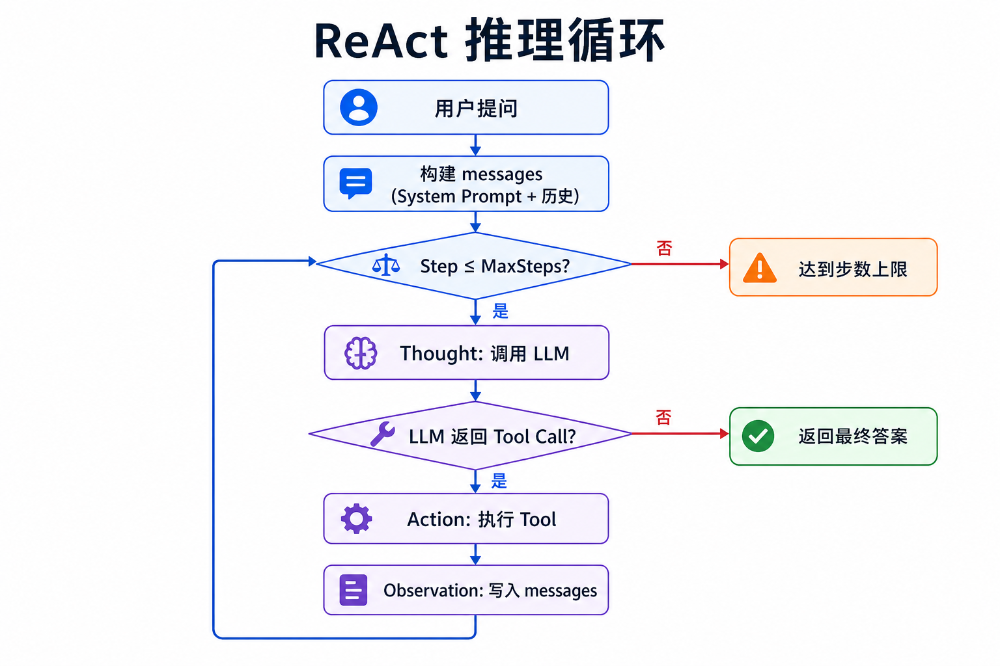

# 答辩 PPT 素材 — 成员 A

> **讲解人：** 成员 A  
> **讲解时长：** 约 2 分钟（第 2、3、5 页）  
> **交给：** 成员 D 整合进完整 PPT（**答辩版**，按项目全部完成后的状态撰写）  
> **项目：** .NET 实验助教 Agent（答疑 + 轻量 RAG）

---

## 一、A 负责的 PPT 页（共 3 页）

| 页码 | 标题 | 文件章节 |
|------|------|----------|
| 第 2 页 | 选题背景与目标 | [§ 二](#二第-2-页选题背景与目标) |
| 第 3 页 | 系统总体架构 | [§ 三](#三第-3-页系统总体架构) |
| 第 5 页 | Agent Loop（ReAct） | [§ 四](#四第-5-页-agent-loopreact) |

---

## 二、第 2 页：选题背景与目标

### 幻灯片标题
**.NET 实验助教 Agent — 我们要解决什么问题？**

### 正文要点（直接贴 PPT）

**背景**
- .NET / AI Agent 课程实验步骤多、概念抽象（ReAct、SK、Tool Calling…）
- 学生常需要查课件、反复问实验步骤
- 需要一个能**自主推理、调用工具、引用文档**的智能助教

**项目目标**
- 开发面向课程实验的 **AI Agent 助教**
- 支持 **ReAct 推理循环** + **Tool 调用** + **RAG 检索** + **Multi-Agent 协作**
- 技术栈：**C# / .NET 9** + **Microsoft.Extensions.AI** + 控制台/Web UI

**已实现能力（答辩展示用）**
- 四层项目结构（Core / Rag / Tools / Console）
- LLM 接入（MiMo API）+ 向量检索知识库 + 自定义 Tool
- ReAct Agent 循环 + 对话/工作记忆 + 推理过程可视化

### 讲解词（约 40 秒）

> 我们小组做的是 .NET 实验助教 Agent。学生在学 Agent 和 Semantic Kernel 实验时，经常要翻很多文档、反复问步骤。我们的目标是做一个能自主推理、能查课件、能分步解答、并给出引用来源的智能助教。最终系统集成了 ReAct 循环、RAG 检索、多 Tool 调用和 Multi-Agent 协作，我负责讲解其中的项目背景、总体架构和 ReAct 核心机制。

### 配图建议
- 无复杂图，可用一张「学生提问 → Agent 回答」示意图（D 可用简单图标）

---

## 三、第 3 页：系统总体架构

### 幻灯片标题
**系统总体架构（分层设计）**

### 正文要点

**Solution 四层结构**

| 项目 | 职责 | 说明 |
|------|------|------|
| `DotNetLabTutor.Core` | Agent 核心、接口、Memory、ReAct 循环 | Agent 大脑 |
| `DotNetLabTutor.Rag` | 文档切块、Embedding、向量检索 | 知识库 |
| `DotNetLabTutor.Tools` | 自定义 Tool / Plugin | Agent 可调用的能力 |
| `DotNetLabTutor.Console` | 用户交互入口 | 控制台 / Web UI |

**核心接口（契约层，定义在 Core）**
- `IAgentService` — Agent 运行入口
- `IRagService` — 知识库检索
- `ISessionMemory` — 对话记忆 + 工作记忆

**设计原则**
- **分层解耦**：Core 定义接口，Rag / Tools 独立实现，便于维护与扩展
- **依赖注入**：`Microsoft.Extensions.DependencyInjection`
- **可观测**：`[AgentStep]` 日志输出 Thought / Action / Observation

### 架构图（**直接插入 PPT**）

| `docs/ppt-images/ppt-architecture.png` | 第 3 页主图（系统总体架构） |



### 讲解词（约 40 秒）

> 架构上分四层：Core 是 Agent 大脑，负责 ReAct 循环和 LLM 调用；Rag 负责把课程文档切块、向量化并检索；Tools 封装检索、查章节、列主题等能力，供 Agent 按需调用；Console 是用户入口。接口都定义在 Core，各层职责清晰，答辩 Demo 里可以看到 Agent 查文档、调 Tool、给出带引用的回答。

### 截图建议（可选放 PPT 角落）
- Solution Explorer 四项目截图
- 或 `docs/handoff-A.md` 中的类清单表

---

## 四、第 5 页：Agent Loop（ReAct）

### 幻灯片标题
**ReAct 推理循环 — Agent 的核心**

### 正文要点

**什么是 ReAct？**
- **Re**asoning + **Act**ing：推理与行动交替进行
- 区别于普通 ChatBot：Agent 能**自主决定**是否调用工具、调用哪个工具

**循环四步（本项目的实现）**

| 步骤 | 含义 | 代码/日志体现 |
|------|------|----------------|
| 1. Thought | LLM 分析当前状态，决定下一步 | `[Step N] Thought: ...` |
| 2. Action | 调用一个 Tool | `[Step N] Action: SearchCourseDocs(...)` |
| 3. Observation | 获取 Tool 返回结果 | `[Step N] Observation: ...` |
| 4. 重复 / 结束 | 继续循环或输出最终答案 | 无 Tool 调用 → 返回答案 |

**终止条件**
- LLM 不再请求 Tool → 返回最终回答
- 达到 `MaxSteps`（默认 8 步）→ 提示「请简化问题」

### ReAct 流程图（**直接插入 PPT**）

| `docs/ppt-images/ppt-react-flow.png` | 第 5 页主图（ReAct 推理循环） |




### Demo 截图说明

**建议截一张控制台 / UI 运行图，包含：**
```
[Step 1] Thought: ...
[Step 1] Action: SearchCourseDocs(...)
[Step 1] Observation: [检索到的文档片段 + 来源] ...
助教: （中文回答，含引用）
（推理步数: 2）
```

**推荐 Demo 问题：** `什么是 ReAct？` 或 `Semantic Kernel 实验第一步做什么？`

### 讲解词（约 40 秒）

> ReAct 是我们 Agent 的核心。用户提问后，Agent 进入 for 循环：每一步先让 LLM 思考，如果需要查资料就发起 Tool Call，执行 Tool 后把结果作为 Observation 写回上下文，LLM 再决定下一步。直到信息足够，直接给出带引用的最终答案。控制台会打印 Thought、Action、Observation，答辩 Demo 时可以清楚看到完整推理过程。实现代码在 `ReActAgentService.RunAsync()`。

---

## 五、交给 D 的素材清单

请 D 整合 PPT 时从本文档取用：

| 素材 | 用于页码 | 格式 |
|------|----------|------|
| 选题背景要点 | 第 2 页 | § 二正文 |
| 架构图 | 第 3 页 | **`docs/ppt-images/ppt-architecture.png`** |
| 四层项目表 | 第 3 页 | § 三表格 |
| ReAct 四步表 | 第 5 页 | § 四表格 |
| ReAct 流程图 | 第 5 页 | **`docs/ppt-images/ppt-react-flow.png`** |
| 代码片段 | 第 5 页（可选） | § 四代码块 |
| Demo 控制台 / UI 截图 | 第 9–10 页 | 全组 Demo 运行后截图（D 整合） |
| Q&A 备用 | 第 12 页 | § 五 |

---
